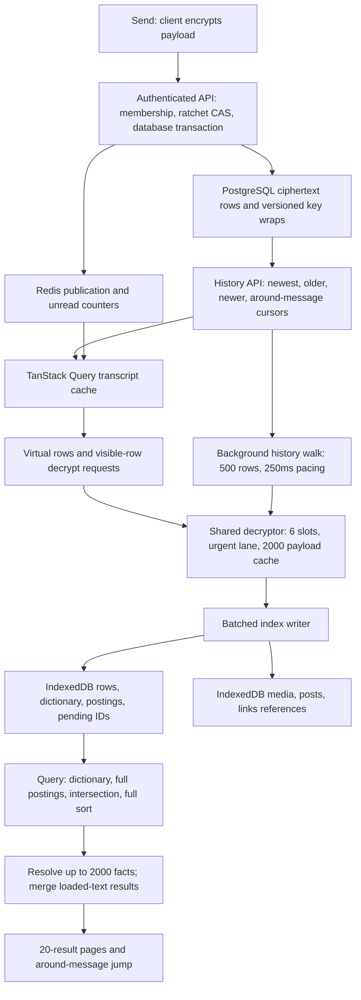

# DM history and search scale audit

Date: 8 October 2026. Target: 20 DMs with 100,000+ messages each, including fresh devices and low-end phones.

**Verdict: the current web pipeline has solid pagination and virtualization foundations, but does not meet this production target.** The most serious problems are repeated device-side archive construction, unbounded posting rewrites and query work, incomplete mutation reconciliation, retained writers, and coverage flags that can overstate recoverability.

This audit changes no application behavior, database schema, or encryption. It adds a reproducible synthetic harness and this report. No Git commands were used. Native-device frame behavior, deployed database plans, and browser disk usage were not measured; they remain release gates.

## Pipeline traced

The conversation list also reads last-message ciphertext and unread state, and requests preview decrypts. It polls every 30 seconds and invalidates on activity events. The `/api/messages/search` endpoint searches people; archive message-text search currently has no server endpoint.

Relevant entry points:

- [Message thread and pipeline wiring](/home/haze/repos/social/apps/web/src/components/messages/message-thread.tsx:905)
- [History and send API](/home/haze/repos/social/apps/web/src/app/api/messages/conversations/[id]/messages/route.ts:37)
- [Conversation list API](/home/haze/repos/social/apps/web/src/app/api/messages/conversations/route.ts:295)
- [Decrypt scheduler](/home/haze/repos/social/apps/web/src/lib/messages/decryptor.ts:51)
- [Index backfill](/home/haze/repos/social/apps/web/src/lib/messages/message-index-backfill.ts:132)
- [Index writer](/home/haze/repos/social/apps/web/src/lib/messages/message-index-writer.ts:179)
- [Persistent store](/home/haze/repos/social/apps/web/src/lib/messages/indexeddb-search-index.ts:768)
- [Search hook](/home/haze/repos/social/apps/web/src/lib/messages/use-conversation-search.ts:215)

## What is already good

- History uses a total `(createdAt, id)` order, bounded page sizes, and keyset cursors. Around-message reads avoid walking the archive to reach an old hit.
- The virtualizer uses stable keys, measured heights, end anchoring, overscan 6, and disables competing browser scroll anchoring. Keep this construction; these choices match the current [TanStack chat guidance](https://github.com/TanStack/virtual/blob/main/docs/chat.md).
- Decryption has bounded concurrency, cached base keys, an urgent lane, invalidation after edits, and identity-scoped payload caching. WebCrypto being asynchronous does not remove the JavaScript work around it.
- The index interns message IDs into numeric row IDs and resolves only a capped result set. It avoids loading the entire row table or all postings up front.
- Backfill fetches outside the transcript cache, persists progress after pages, has retry and abort handling, and yields to foreground history reads. Its 25-page runs automatically chain while a consumer remains open; the archive is not limited to 12,500 rows.
- Writes are coalesced, and text writes are split into 64-entry transactions. IndexedDB transactions serialize allocation and writes. These controls mitigate contention but do not bound the size of a token record.
- Automatic stored-row key recovery and versioned conversation-key epochs are deliberate and must remain intact.

## Findings, in implementation order

### 1. P1: writer lifetime leaks memory and background work

[Writer subscription](/home/haze/repos/social/apps/web/src/lib/messages/message-index-writer.ts:607) ignores the unsubscribe returned by `subscribeToPayloads`. The writer exposes no disposal method, and [thread cleanup](/home/haze/repos/social/apps/web/src/components/messages/message-thread.tsx:3248) only clears its ref.

Each listener retains its writer closure, including the unbounded `written` map of text/ref signatures. A full 100k-message backfill can retain 100k signatures; subsequent chat visits retain additional writers. Pending rows can keep old writers scheduling flushes into old stores. Timers and in-flight callbacks also have no disposed-generation guard.

Synthetic reproduction: 20 created writers retained 20 listeners and called zero unsubscribe functions. This demonstrates the registration behavior, not a browser heap measurement.

Fix: add disposal, unsubscribe, clear timers, prevent late callbacks from publishing, and cap the recent-signature cache independently of persisted coverage. Preserve coverage as durable counters rather than using a forever-growing map. Add switch/unmount and in-flight-disposal tests.

### 2. P1: pending overflow violates the backfill recovery promise

[Pending persistence](/home/haze/repos/social/apps/web/src/lib/messages/message-index-writer.ts:260) slices the durable set to 5,000 IDs but returns success. The backfill treats the returned `stillPending` IDs as recoverable and can advance its cursor beyond them.

Synthetic reproduction: 6,000 failures were reported in memory, only 5,000 IDs persisted, and `failed` was false. After reload, 1,000 retry IDs disappear. A completed verdict and verified cursor can then keep a future walk from revisiting those rows.

Fix: store pending work as individually keyed records or durable ranges/pages; bound RAM rather than truncating recoverable state. Until that exists, stop cursor advancement when the complete pending set cannot be persisted. Track seen, searchable, failed, and recoverable separately. Test overflow followed by reload and successful key recovery.

### 3. P1: account-specific visibility shares one persistent index

[IndexedDB keys](/home/haze/repos/social/apps/web/src/lib/messages/message-db.ts:21) use conversation ID, without account or identity scope. [Logout](/home/haze/repos/social/apps/web/src/hooks/auth/use-logout.ts:44) clears query/local/session storage, but leaves IndexedDB. The decryptor's account scope does not scope this plaintext cache.

Two accounts participating in the same conversation have different hide decisions, and den participants can have different historical visibility. Reusing one conversation index can serve another account's cached previews/refs or reuse its tombstones. Identity reset similarly does not invalidate this index. The HTTP membership gate does not validate every cached search result.

Fix: namespace all search/ref/pending/meta records by account and an explicit visibility/recovery generation. Stop old-account jobs before switching; clear or retire that account's derived data on reset and access revocation. Never delete the shared identity store as a shortcut. Test two participants using the same browser and different hidden-message sets.

### 4. P1: the full archive repeatedly gets rebuilt on devices

[Default eviction budget](/home/haze/repos/social/apps/web/src/lib/messages/search-index-eviction.ts:20) is 200,000 allocated text rows across all chats. The target is at least two million messages. For twenty completely indexed 100k-row chats, the policy evicts eighteen, retaining only two.

Eviction also clears shared-content refs. A fresh device, a cache eviction, and an index-format rebuild all require history fetch/decrypt/index work again. Desktop details being visible starts the walk even without opening text search.

At 500 rows/page, two million messages need about 4,000 pages. The 250ms pacing alone is roughly 1,000 seconds across sequential walks, before networking, decryption, coverage checks, retries, and writes. This is a lower-bound calculation, not a measured completion time. Twenty chats do not currently backfill simultaneously in one thread.

The advertised LRU is also incomplete: `lastAccessedAt` is initialized to zero and carried through metadata, but no runtime search/open/write path updates it. The allocator's count includes tombstones, and the budget omits ref count and actual bytes. The 92-byte estimate explicitly predates the current format; it cannot establish current quota safety.

Fix: use server archive search plus an expendable local working cache. If retaining local-only archive search, use a measured byte budget and browser storage headroom, update actual access recency, account for refs/tombstones, and expose partial coverage honestly. Simply raising the row cap trades repeated rebuilds for device storage pressure. Browser storage is origin-wide and can be evicted; [MDN quota guidance](https://developer.mozilla.org/en-US/docs/Web/API/Storage_API/Storage_quotas_and_eviction_criteria) explains why it cannot be the only full-history search substrate.

### 5. P1: persistent posting writes still scale with archive size

[Posting update](/home/haze/repos/social/apps/web/src/lib/messages/indexeddb-search-index.ts:972) reads a whole token record, copies it into mutable arrays, updates it, copies it back, and writes the whole record. One common word can have 100k+ row/time pairs. The full dictionary is also read and rebuilt into a Map each chunk, then rewritten when allocation advances.

Small transactions do not make this O(batch): total construction of an ubiquitous token is quadratic in message count for fixed-size batches. The in-memory backend's amortized append throughput does not measure this serialization path.

Model using actual 500-row page and 64-entry chunk boundaries:

| Messages containing one token | Token-record rewrites | Cumulative row/time array payload submitted | Final row/time arrays |
| --- | --: | --: | --: |
| 100,000 | 1,600 | 916.20 MiB | 1.14 MiB |
| 200,000 | 3,200 | 3,663.45 MiB | 2.29 MiB |

This is a deterministic payload model, not measured disk I/O. It excludes read clones, dictionary rewrites, other tokens, previews, ref records, and engine overhead. Term frequency determines the actual cost.

Fix: keep bounded posting segments/delta records and compact outside foreground work, with hard limits on compaction RAM. Store dictionary terms as point-addressable records rather than one unbounded header. Use per-row revisions to make replay cheap. The inner `update.add.includes(...)` loop is a smaller additional batch cost; use direct row/time lookup once per batch.

### 6. P1: search pages repeat full intersection and full sorting

[Intersection and ordering](/home/haze/repos/social/apps/web/src/lib/messages/search-index-format.ts:655) materialize every matching row, build membership Maps for other lists, and sort the full result set. The cursor is applied after that sort. [Persistent query](/home/haze/repos/social/apps/web/src/lib/messages/indexeddb-search-index.ts:1340) repeats this on every query/page read, with full dictionary and posting-list clones.

The 2,000-fact cap and 20 visible results bound projection/rendering only. They do not bound posting bytes, total-match allocation, CPU sorting, or exact-count cost. Query cancellation in the hook discards stale answers but does not cancel underlying index work.

Synthetic Bun measurements, one ubiquitous token, deliberately mixed timestamp order, 20 returned rows, seven measured iterations after one warm-up:

| Matched rows | Median CPU work | Maximum CPU work |
| -----------: | --------------: | ---------------: |
|      100,000 |        19.22 ms |         20.43 ms |
|      200,000 |        38.09 ms |         49.02 ms |
|    1,000,000 |       319.89 ms |        336.10 ms |

These timings exclude browser IndexedDB, debounce, structured cloning, row reads, React, and a low-end CPU. One million here is a single stress-test posting, not a cross-conversation query. They establish growth, not device latency guarantees.

Fix: execute local indexing/query computation in one worker, return just a result page, and use cancellable request generations. Use ordered segment traversal or bounded top-K selection instead of sorting all matches. Intersect sorted row arrays with merge/galloping searches instead of allocating a Map for every large input. Return first results/`hasMore` promptly; compute/cache exact totals separately if the product requires them. Workers can own fetch and IndexedDB directly, avoiding transfers of whole corpora; see [MDN workers](https://developer.mozilla.org/en-US/docs/Web/API/Web_Workers_API/Using_web_workers).

### 7. P1: edits, deletions, and cross-tab changes lack durable reconciliation

[Edit event handling](/home/haze/repos/social/apps/web/src/components/messages/message-thread.tsx:4393) replaces and invalidates only a message present in loaded pages. An edited indexed message outside those pages is not handed to the index writer. While the app is closed, or another conversation is active, mutation events can be missed altogether.

Reconnect invalidates the loaded transcript/detail. A newest-five-row coverage probe checks presence, not revisions. A previously completed archive index has no mutation watermark that detects older edits, deletes, hides, or recovery changes. The backfill's presence check skips existing entries rather than verifying their content revision.

The store's row-facts cache is per store instance and invalidated by mutations through that instance. It has no external write notification, so another tab/instance can leave cached previews or removed rows stale.

Fix: add a monotonic durable mutation log/cursor covering create/edit/delete/hide/reset/access changes; replay it independently of the visible transcript. Process out-of-window events too. Version local entries, fence stale writers, and broadcast committed generations across tabs. If a cursor expires, invalidate coverage and repair a bounded range or switch to server search. Test offline edits/deletes, non-active chats, cross-tab hides, and revoked historical visibility.

### 8. P1: history retention is not a hard moving window

[Transcript trim](/home/haze/repos/social/apps/web/src/components/messages/message-thread.tsx:3944) drops only oldest pages once the viewport is well above that boundary. While a reader continuously loads older pages, the viewport stays near that boundary and the growing newer tail remains retained. The viewer has the same directional limitation. Live arrivals can also indefinitely grow a tail page because pages themselves have no row cap.

Synthetic trim-policy input: 1,000 loaded pages with first visible index zero drops zero pages. This is an allowed input illustrating the missing hard ceiling, not a reproduction of 100k rendered DOM nodes.

Every page append then flattens retained rows and rebuilds several maps and transcript derivations. Opening search requests every missing loaded decrypt even though its corpus cap is 3,000 and the decryptor cache cap is 2,000. Pending decrypt requests themselves are not bounded by the terminal cache cap. Per-completion microtask notifications and 16ms whole-page settlement scans add pressure during backfill.

Fix: maintain a strict two-sided message window around an anchor, roughly 500–1,500 rows initially as a tunable target, trimming the opposite end of travel. Keep the live tail separately when viewing old history; never append recent messages across an unrepresented historical gap. Preserve the anchor's pixel offset and retain boundary cursors. Bound queue admission and cache bytes, not only entry count, since media payload sizes vary. Publish completion batches per frame or fixed short interval, with immediate delivery for the urgent visible lane.

TanStack Query documents [bounded infinite queries](https://github.com/TanStack/query/blob/main/docs/framework/react/guides/infinite-queries.md) and sequential refetch cost. `maxPages` is useful but cannot be blindly applied here: bidirectional seams, live-tail handling, selection/reply anchors, and scroll-position restoration need coordinated changes.

### 9. P1: unread counting materializes the entire backlog

[Conversation list count](/home/haze/repos/social/apps/web/src/app/api/messages/conversations/route.ts:427) selects every unread `conversationId` row with `.all()` and groups in JavaScript. [Global badge seeding](/home/haze/repos/social/apps/web/src/app/api/messages/unread-count/route.ts:186) does the same to use array length. Both can allocate and transfer hundreds of thousands or millions of rows. List activity invalidation and 30-second polling repeat list work.

Fix first: database-side grouped counts for the visible list and an aggregate count for badge recovery. That bounds rows transferred but still scans qualifying unread history. For sustained scale, maintain transactional per-member unread counters, with idempotent updates and database reconciliation. Redis remains a cache, not the only source; handle read/delete/hide/mute/reset changes and preserve den visibility windows. Coalesce list activity updates rather than rereading the whole list per incoming message.

### 10. P1: refs completion can be declared with missing refs

Text and refs have independent write transactions. On refs failure after successful text writing, the writer puts the ID in durable pending, but the text success already removed it from the in-memory retry map. A payload notification alone therefore need not retry refs. Backfill marks `refsReachedStart` from reaching the beginning, without requiring the refs to have committed; later presence checks can skip a text-indexed row.

Synthetic full backfill with one URL and a rejected refs write: `refsReachedStart: true`, pending count 1, stored links 0.

Fix: track durable work per artifact and revision. Mark range traversal separately from completed artifact coverage. Either block the corresponding completion verdict or persist a retryable refs-specific job. Verify an interrupted/reloaded walk repairs the missing link without requiring the user to load its message into the transcript.

### 11. P2: matching semantics change with cache residency

Loaded-text matching uses substring search; persistent matching uses whitespace tokens with exact completed words and trailing prefixes. The same query therefore changes answers after reload or scrolling. Punctuation, URL parts, scripts without whitespace, emoji, and diacritics deserve an explicit product contract.

Synthetic example: `deploy` matches loaded `redeployment hello,`, but returns zero through persistent prefix search. A prefix matching 65 dictionary terms returns zero because the expansion cap is 64; the UI cannot distinguish that refusal from no matching messages.

Fix: choose one normalization/tokenization/matching contract and apply it everywhere. Use indexed prefix lookup and a progressive broad-query state rather than a false empty answer. If substring matching is required, evaluate bounded n-gram/trigram candidates and verify full text for results; measure the index-size cost. Change tokenizer versions with explicit rebuild/synchronization semantics. Keep match-centered snippets for old hits rather than always showing the first 200 characters.

### 12. P2: history indexes and payload limits need production evidence

The authored [message contract](/home/haze/repos/social/packages/db/prisma/contract.prisma:942) has `(conversationId, createdAt)` and `(conversationId, id)`, but no single `(conversationId, createdAt, id)` index for the API's full ordering. The existing timestamp index can still serve useful ranges; missing the third column is a plan risk, not proof of a slow deployed query.

Measure newest, oldest, around, tied timestamps, hide-heavy history, and unread queries using `EXPLAIN (ANALYZE, BUFFERS)` on at least two million realistic rows. If justified, add the triple index and assess `(conversationId, senderId, createdAt, id)` for unread/per-sender ranges. B-tree indexes can satisfy ordering; [PostgreSQL ordering documentation](https://www.postgresql.org/docs/current/indexes-ordering.html) explains the plan tradeoffs.

A 500-row walk is bounded by row count but each ciphertext may be 100,000 characters: about 50 MB of ASCII ciphertext per worst-case page before metadata. Repeated sender metadata inflates responses too. Add a response-byte budget, a slimmer bulk projection, deduplicated sender facts, adaptive page sizes, and bounded fetch/concurrency budgets. Avoid silently dropping searchable portions of accepted long messages.

## Recommended production architecture

**Use server archive search as the full-history source, with a small worker-owned local cache for recent/offline results.** This is a recommendation inferred from the product's existing server-recoverable encryption model. Server storage currently containing ciphertext does not mean the server lacks the ability to recover message text.

Index construction becomes shared server work per message/revision instead of repeated work per device and eviction. A fresh low-end phone downloads results and a small anchored window; it does not need a two-million-message local index to search twenty conversations.

1. Commit a durable indexing outbox alongside message mutations. Process after commit with bounded concurrency, idempotence, revision checks, retries, and a dead-letter/recovery path. Index root-key epochs using existing recoverable wraps; retain self-scoped reset behavior and peer epoch access.
2. Start by evaluating PostgreSQL text search with the chosen multilingual matching semantics and selective conversation predicates. PostgreSQL recommends [GIN for text search](https://www.postgresql.org/docs/current/textsearch-indexes.html). This does not guarantee common-prefix latency or time-order pagination: benchmark the actual plans. Adopt a separate search service only if measured workload and operating cost justify it.
3. Keep plaintext payloads encrypted as today. A server search representation creates additional sensitive derived data: explicitly document its storage and access policy. Store only required terms/facts, and decrypt selected hits for snippets if suitable. Do not silently treat this as already-approved plaintext server storage or label the system end-to-end encrypted.
4. Authenticate every request and enforce current membership, time windows, blocks, global deletion, and per-user hides before selecting the page and computing counts. Filter during retrieval, not only after slicing twenty hits. Revalidate a result when loading its message.
5. Return a cursor, a small result page, `hasMore`, and index freshness. Deliver exact totals separately when expensive. Revision changes must invalidate count/result caches; tie cursor validity to query, account, ordering, and index generation.
6. Keep recent messages, previews, and a bounded offline search cache in an account-scoped worker. Separate offline coverage from online full-archive coverage in the UI. Cache eviction then costs cache misses rather than minutes of archive rebuilding.

If device-only full-archive search remains a firm product requirement, use bounded posting segments plus worker ownership, per-account byte budgets, durable mutation replay, multi-tab writer ownership, and hard transcript/decrypt queues. Entire-origin storage eviction still prevents a universal instant-search guarantee on every fresh device; local-only cold-start expectations must explicitly include rebuilding time.

## Staged delivery plan

| Stage | Scope | Exit evidence |
| --- | --- | --- |
| 1 | Writer disposal, bounded signatures, lossless pending state, refs verdict repair, account scoping | Reproductions reversed; reload, account-switch, and recovery tests |
| 2 | DB-side unread aggregation, activity coalescing, strict transcript window, bounded decrypt admission | Bounded retained rows/queue; no scroll drift at either boundary |
| 3 | Worker ownership, first-page query budget, posting/dictionary segmentation if local archive remains | Main-thread traces and flat append-cost curves as the archive grows |
| 4 | Durable mutation outbox/log, revisions, replay, cross-tab generation handling | Offline edits/deletes/hides converge without reopening every old message |
| 5 | Server archive search, feature-flagged side-by-side validation, historical backfill | Recall matches ground truth; authorization parity; load-tested query plans |
| 6 | Physical-device validation, rollout metrics, kill switch and rollback | Target matrix meets budgets during backfill and long sessions |

Database work must follow this repository's Prisma 8 contract/migration workflow. Prebuild large-table indexes concurrently outside migration transactions where the generated precheck permits it; review packages and paths, apply through the migration runner, and verify schema. See [upstream migration architecture](https://github.com/prisma/orm/blob/main/docs/architecture%20docs/subsystems/7.%20Migration%20System.md). No migrations were authored or applied in this audit.

## Proposed performance acceptance criteria

These are initial release targets to validate and tune, not measured guarantees. Fix a reference low-end Android device, an iPhone/Safari reference, and explicit network latency/bandwidth conditions. Desktop CPU throttling is supplemental, not a substitute for physical devices.

| Operation or resource | Initial target |
| --- | --- |
| Typing feedback | Input-to-paint p95 under 50 ms while indexing |
| Local warm first-result page | p95 under 100 ms after debounce, with declared corpus coverage |
| Online archive first-result page | p95 under 300 ms after debounce on the declared reference network |
| Foreground scroll | Frame time p95 within the device refresh interval; no recurring >50 ms indexing tasks on the main thread |
| Anchor preservation | No unexplained movement over 2 CSS pixels during prepend/trim/measurement |
| Cached search jump | p95 under 500 ms |
| Network search jump | p95 under 1.5 s on reference network, with explicit slow/failure state |
| Retained transcript | Hard row/byte ceiling independent of total archive size |
| Added DM working memory | Initially target under 64 MiB over the app baseline; separately bound media and worker heaps |
| Lifecycle | No growth in listeners, idle jobs, or retained writers after 100 conversation switches |
| Durable correctness | No skipped messages after retry/reload; no stale deleted/hidden results; matching stable across cache residency |

Measure full browser storage rather than relying on bytes-per-row assumptions. Record actual transaction latency and structured-clone cost under simultaneous search/indexing. Track p50/p95/p99 query/page/jump latency, input delay, long tasks, dropped frames, cache rebuild frequency, index lag, pending work by reason, and retry counts. Never log message text or raw queries into routine telemetry.

Fixture matrix: 20 × 100k and 20 × 200k messages; one 1M-message chat as an optional larger stress case; common words, rare words, broad prefixes, many distinct URLs, multilingual/no-space text, max accepted bodies, media-heavy mixes, tied timestamps, hidden/deleted rows, unread backlogs, multiple key epochs. Exercise cold/warm search, concurrent backfill, upward/downward long scroll, live messages while reading old history, offline mutation/reconnect, multi-tab writes, quota errors, origin eviction, identity recovery/reset, and account changes.

## Verification performed

- 321 tests passed across seven core search/index/decrypt/retention suites.
- 342 tests passed across twelve additional matching, eviction, refresh, walk policy, anchored window, storage, crypto/recovery, shared-ref, and API suites. Total: **663 passed, zero failed** in these two focused runs.
- [Synthetic audit harness](/home/haze/repos/social/scripts/audit-dm-scale.ts) reproduced the policy/lifecycle/coverage/matching cases and CPU/model results above. Run `bun scripts/audit-dm-scale.ts`; it uses no production database or network. [Captured result](/home/haze/repos/social/audits/dm-scale-2026-10-08.json).
- `bun run check-types` passed the scripts stage, then failed in the unrelated `den_shared_wallpaper` migration with TS2883 naming errors for Prisma planner types. That migration was not changed. This is not a clean repository-wide type check.
- `bun run --cwd apps/web check-types` passed. `bun run check` passed on an isolated copy of the new artifacts using the repository's copied configuration and installed tooling; only the formatted new files were copied back. This avoids auto-fixing unrelated workspace changes. The repository's lint configuration exempts scripts; the harness is checked by TypeScript and execution.
- The existing [seed benchmark](/home/haze/repos/social/scripts/bench-index-against-seed.ts:3) explicitly uses the memory backend. It cannot certify browser IndexedDB throughput, quota behavior, low-end frame stability, or two-million-message cache retention. Its comment suggesting a real IndexedDB measurement should not be treated as an available browser benchmark.
- No deployed query plans, real browser throughput, physical device frames, or server archive prototype were measured. The production-readiness verdict is therefore a code and synthetic-evidence assessment; it is not a completed performance certification.
